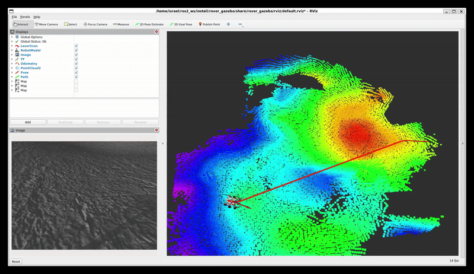

## 🛰️ ROS 2 Mars Rover: Autonomous Navigation on the Moon 🌕
This project simulates an autonomous Mars-style rover navigating a lunar terrain using ROS 2 (Humble), Gazebo, and custom navigation stacks. The rover is equipped with simulated LIDAR, joystick teleoperation, autonomous obstacle avoidance, and a modular control framework designed for extreme planetary environments

## Table of Contents

1. [Installation](#installation)
    - [System Preparation & Package Installation]
2. [Linux Service](#usage)
3. [Gazebo Simulation](#SaveMap)


## Installation
#### System Preparation & Package Installation
Clone the ros2_rover repository and install the dependencies
```shell
cd ~/ros2_ws/src
git clone https://github.com/mgonzs13/ros2_rover
cd ~/ros2_ws
rosdep install --from-paths src -r -y
colcon build
```

## Linux Service 
Set up and launch your robot software as a system-level service, so it can run without manually starting it each time.
```shell
cd ~/ros2_ws/src/ros2_rover/rover_service
sudo ./install.sh
```

##  Check rover service 
Set up a systemd-based launch service for the robot.
```shell
cd ~/ros2_ws/src/ros2_rover/rover_service
sudo ./install.sh
```


## Gazebo Simulation
This command launches the Gazebo simulation environment configured for lunar terrain, enabling the Mars-style rover to operate and navigate as if it were on the surface of the Moon.
```shell
ros2 launch rover_gazebo moon.launch.py
 ```

<div align="center">
  
</div>


<div align="center">
  
</div>


